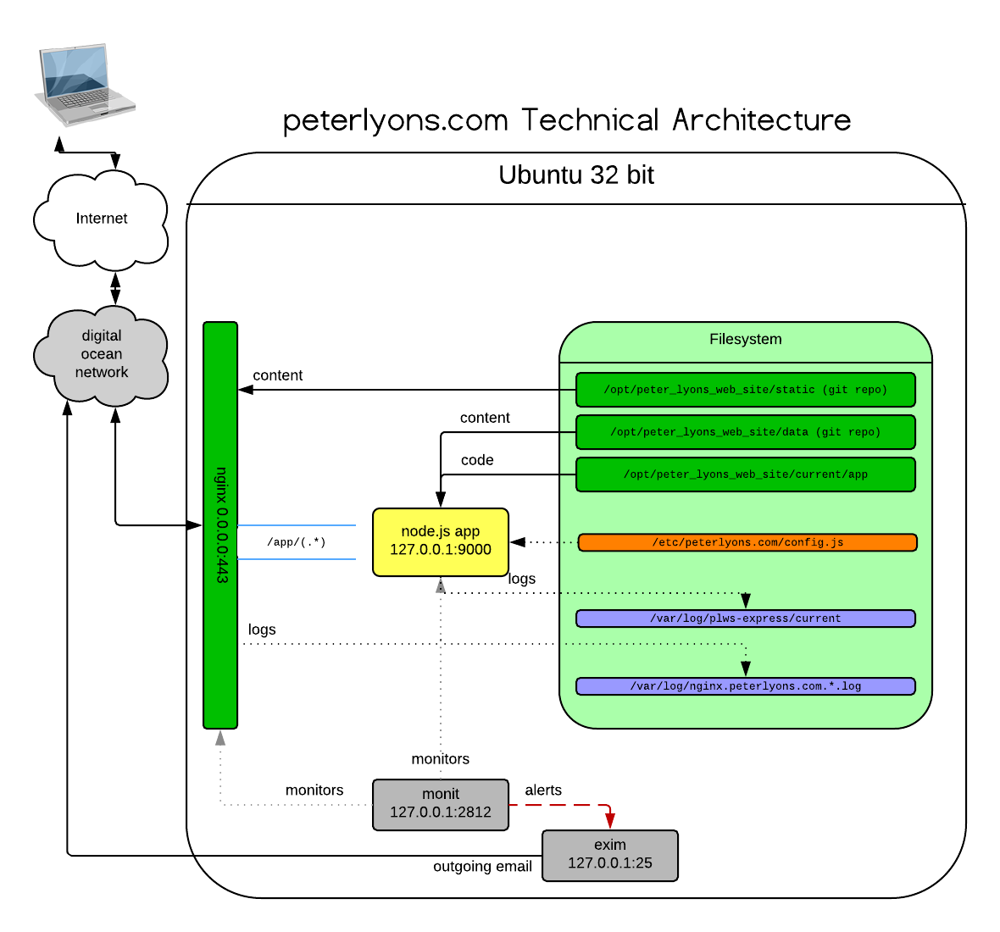

# peterlyons.com web site

This repo contains a node.js/hapi web application I use to power my professional web site at [https://peterlyons.com]() and personal site at [https://peterlyons.org]()

Basically, the site supports content in the following formats:

 - pages written as [pug](https://pugjs.org) templates
 - pages written in [markdown](http://daringfireball.net/projects/markdown/)
 - a basic blog engine
   - Includes an ATOM feed
   - Allows posts in HTML or markdown
   - contains some DSL magic HTML-ish tags to reduce boilerplate
   - has a handy output pipeline
 - a simple photo gallery system

Over the years, I've tried out various deployment methodologies and file layouts. I tried a full-on static site generator with all the generated files in the git repo, and have now decided I do not like that approach. Thus this site serves dynamic content primarily with tiny bits of caching at the few spots where we get decent bang for our caching buck.

The site requires 3 git repositories to fully function

1. The code (this repository) (also photo gallery metadata)
2. The data/content (blog posts)
3. Static files (images, fonts, etc)

The data and static repositories aren't particularly interesting. All the interesting code is in this repository.

The code has a bunch of shared stuff (layout, css) between my professional and personal sites. Each site has its own hapi server that listens on a distinct port and nginx configuration that reverse proxies traffic and does TLS termination.

## How to Set Up for Development (OS X Scripted)

- run `./bin/install-prereqs.sh`

## How to Set Up for Development (Manual or custom)

- Install prereqs (homebrew is the recommended approach on OS X)
  - git
  - nvm
  - ansible (python virtualenv recommended)
  - vagrant
  - tar (included with OS X)
  - curl (included with OS X)
- Use nvm to install node
  - cd to repo root directory
  - `nvm install`
- `npm install`

## How to test

- `./bin/test-node.sh` to run the node tests
- `./bin/test-browser.sh` to run the headless browser tests
- `./bin/test.sh` to run both node and browser tests
- `./bin/test-integration.sh` to run the integration tests

## How to setup the stage vagrant vm

- vagrant up stage
- vagrant ssh stage
  - `sudo adduser plyons`
  - `sudo adduser plyons sudo`
- On your dev laptop, add a record to `/etc/hosts` for `stage.peterlyons.com` (or use the IP)
- as plyons on your laptop: `ssh-copy-id stage.peterlyons.com`
- `ssh stage.peterlyons.com`
  - `sudo su -`
  - Run the `setup-tls-acme.sh` script
  - Provision TLS from letsencrypt with domain validation
  - `sudo su - acme` to become the acme user
  - `export DO_API_KEY='get-this-api-key-from-digitalocean'`
  - `"${HOME}/.acme.sh/acme.sh" --issue --dns dns_dgon --domain stage.peterlyons.org  --domain www.peterlyons.org --keylength ec-256`
- `su - acme -c '"${HOME}/.acme.sh/acme.sh" --renew --domain "stage.peterlyons.com" --ecc'`

## How to Build

- check prereqs
  - do work in the develop branch
  - when ready to cut a release candidate, get develop into a clean committed state
  - make sure you are backmerged from master (normally this should always be true)
- `./bin/release-candidate.sh <patch|minor|major>`
  - (patch is the default)*
- `vagrant up`
  - make sure the build and stage vagrant boxes are up
- `./bin/build.sh "v$(jq -r .version < package.json)"` create a build
  - Normally `<version>` is the new git tag created
    - also supported is `WORK` to make a build out of files in your working directory
      - they must be at least added via `git add` but don't need to be committed
    - also supported is `HEAD` or any other git commit refspec
      - Any of these flavors will build using files from git exclusively regardless of the state of your working directory
- `./bin/deploy.sh build/<build>.tar.gz deploy/host-vagrant-stage.yml`
  - deploy that to the vagrant "stage" vm from your laptop via   - vagrant sudo password is `password`
- Test that stage looks OK
- `./bin/release.sh`
  - if all looks good you can finalize the release with

## How to Deploy

- `./bin/deploy.sh build/<build>.tar.gz deploy/host-production.yml`

# License

**The MIT License (MIT)**

Copyright © 2018 Peter Lyons LLC

Permission is hereby granted, free of charge, to any person obtaining a copy of this software and associated documentation files (the "Software"), to deal in the Software without restriction, including without limitation the rights to use, copy, modify, merge, publish, distribute, sublicense, and/or sell copies of the Software, and to permit persons to whom the Software is furnished to do so, subject to the following conditions:

The above copyright notice and this permission notice shall be included in all copies or substantial portions of the Software.

THE SOFTWARE IS PROVIDED "AS IS", WITHOUT WARRANTY OF ANY KIND, EXPRESS OR IMPLIED, INCLUDING BUT NOT LIMITED TO THE WARRANTIES OF MERCHANTABILITY, FITNESS FOR A PARTICULAR PURPOSE AND NONINFRINGEMENT. IN NO EVENT SHALL THE AUTHORS OR COPYRIGHT HOLDERS BE LIABLE FOR ANY CLAIM, DAMAGES OR OTHER LIABILITY, WHETHER IN AN ACTION OF CONTRACT, TORT OR OTHERWISE, ARISING FROM, OUT OF OR IN CONNECTION WITH THE SOFTWARE OR THE USE OR OTHER DEALINGS IN THE SOFTWARE.
