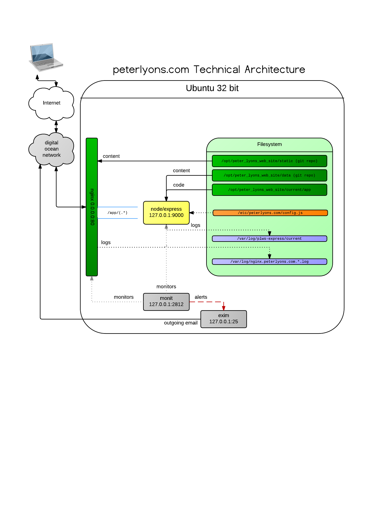

# peterlyons.com web site

This repo contains a node.js/express.js web application I use to power my professional web site at [http://peterlyons.com]() and personal site at [http://peterlyons.org]()

Basically, the site supports content in the following formats:

 - static html pages
 - pages written in [jade](https://github.com/visionmedia/jade)
 - pages written in [markdown](http://daringfireball.net/projects/markdown/)
 - a basic blog engine
   - Includes an ATOM feed
   - Allows posts in HTML or markdown
   - contains some DSL magic HTML-ish tags to reduce boilerplate
   - has a handy output pipeline
 - a simple photo gallery system

Over the years, I've tried out various deployment methodologies and file layouts. I tried a full-on static site generator with all the generated files in the git repo, and have now decided I do not like that approach. Thus this site serves dynamic content primarily with tiny bits of caching at the few spots where we get decent bang for our caching buck.

## Related repositories

The site requires 3 git repositories to fully function

1. The code (this repository)
2. The data (blog posts and photo gallery metadata)
3. Static files (images, fonts, etc)

The data and static repositories aren't particularly interesting. All the interesting code is in this repository.

## New Developer Setup (OS X Scripted)

- run `./bin/install-prereqs.sh`

## New Developer Setup (Manual or custom)

- Install prereqs (homebrew is the recommended approach on OS X)
  - git
  - nvm
  - ansible (python virtualenv recommended)
  - vagrant
  - tar (included with OS X)
  - curl (included with OS X)
- Use nvm to install node
  - cd to repo root directory
  - `nvm install`
- `npm install`

## Build Notes

- do work in the develop branch
- when ready to cut a release candidate, get develop into a clean committed state
- make sure you are backmerged from master (normally this should always be true)
- run `./bin/release-candidate.sh <patch|minor|major>`
  - (patch is the default)*
- make sure the build and stage vagrant boxes are up with `vagrant up`
- create a build `./bin/build.sh <version>`
  - Normally `<version>` is the new git tag created
  - also supported is `WORK` to make a build out of files in your working directory
     - they must be at least added via `git add` but don't need to be committed
   - also supported is `HEAD` or any other git commit refspec
     - Any of these flavors will build using files from git exclusively regardless of the state of your working directory
- deploy that to the vagrant "stage" vm from your laptop via `./bin/deploy.sh build/<build>.tar.gz deploy/host-vagrant-stage.yml`
  - vagrant sudo password is `password`
- Test that and if all looks good you can finalize the release with
- `./bin/release.sh`
- deploy to prod with `./bin/deploy.sh build/<build>.tar.gz deploy/host-production.yml`

# License: MIT
Copyright (c) 2013 Peter Lyons

Permission is hereby granted, free of charge, to any person obtaining a copy of this software and associated documentation files (the "Software"), to deal in the Software without restriction, including without limitation the rights to use, copy, modify, merge, publish, distribute, sublicense, and/or sell copies of the Software, and to permit persons to whom the Software is furnished to do so, subject to the following conditions:

The above copyright notice and this permission notice shall be included in all copies or substantial portions of the Software.

THE SOFTWARE IS PROVIDED "AS IS", WITHOUT WARRANTY OF ANY KIND, EXPRESS OR IMPLIED, INCLUDING BUT NOT LIMITED TO THE WARRANTIES OF MERCHANTABILITY, FITNESS FOR A PARTICULAR PURPOSE AND NONINFRINGEMENT. IN NO EVENT SHALL THE AUTHORS OR COPYRIGHT HOLDERS BE LIABLE FOR ANY CLAIM, DAMAGES OR OTHER LIABILITY, WHETHER IN AN ACTION OF CONTRACT, TORT OR OTHERWISE, ARISING FROM, OUT OF OR IN CONNECTION WITH THE SOFTWARE OR THE USE OR OTHER DEALINGS IN THE SOFTWARE.
